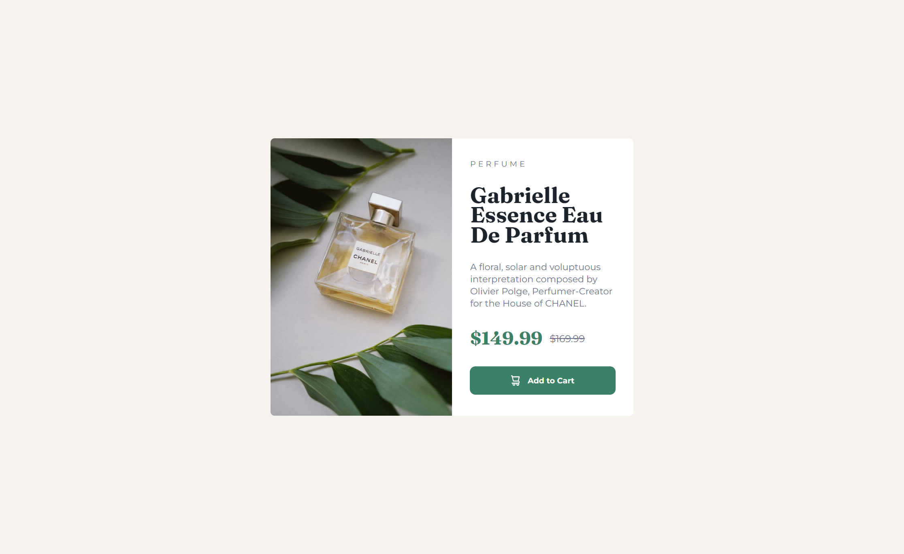

# Frontend Mentor - Product preview card component solution

This is a solution to the [Product preview card component challenge on Frontend Mentor](https://www.frontendmentor.io/challenges/product-preview-card-component-GO7UmttRfa). Frontend Mentor challenges help you improve your coding skills by building realistic projects. 

## Table of contents

  - [The challenge](#the-challenge)
  - [Screenshot](#screenshot)
  - [Links](#links)
- [My process](#my-process)
  - [Built with](#built-with)
  - [What I learned](#what-i-learned)
  - [Continued development](#continued-development)
  - [Useful resources](#useful-resources)
- [Author](#author)
- [Acknowledgments](#acknowledgments)

### The challenge

Your challenge is to build out this product preview card component and get it looking as close to the design as possible.

Users should be able to:

- View the optimal layout depending on their device's screen size
- See hover and focus states for interactive elements

### Screenshot

### Links

- Solution URL: [Add solution URL here](https://your-solution-url.com)
- Live Site URL: [Add live site URL here](https://your-live-site-url.com)

### Built with

- Semantic HTML5 markup
- CSS custom properties
- Flexbox
- Mobile-first workflow

### What I learned

1. I tried to use a different technique to work with font-size this time , i used the calc() function , it doesn't work out well because i can't put a maximum , instead with clamp in can. 
2. I learnt to use create variable without using Sass , just in pure css. 

### Continued development

- I need to to search and see if there are other way beside the clamp() function for responsive text

## Author

- Frontend Mentor - [@zakaria_jamali](https://www.frontendmentor.io/profile/ZakJam)
- Instagram - [@zakaria_jamali_18](https://www.instagram.com/zakaria_jamali_18/)

